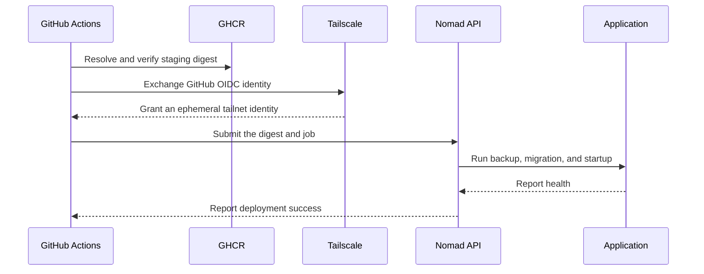

# Hosting and deployment

This guide defines a reusable deployment model for websites hosted on the homelab.

It separates stable machine configuration from frequent application releases.

## Architecture

The platform uses these components:

- NixOS configures the host and the hosting platform.
- Nomad schedules and supervises application workloads.
- GHCR stores immutable OCI images.
- Tailscale gives CI private access to the Nomad API.
- GitHub Actions builds images and submits Nomad jobs.
- GitHub Environments control production approvals.
- SOPS protects bootstrap and recovery secrets.
- Nomad Variables provide secrets to running workloads.

The deployment path is:

```mermaid
flowchart LR
  Commit[Accepted source commit] --> Checks[GitHub Actions checks]
  Checks --> Image[OCI image in GHCR]
  Image --> Evidence[SBOM, provenance, signature]
  Evidence --> Digest[Immutable digest]
  Digest --> Staging[Staging Nomad job]
  Staging --> Approval[Production approval]
  Approval --> Verification[Evidence verification]
  Verification --> Production[Production Nomad job]
```



## Responsibility boundaries

### NixOS

NixOS owns stable host infrastructure:

- Docker and Nomad packages;
- Nomad server and client configuration;
- Tailscale connectivity;
- firewall rules;
- storage roots;
- reverse proxy infrastructure;
- monitoring agents;
- backup schedules;
- bootstrap secrets.

Changing this layer requires `nixos-rebuild switch`.

Normal application releases must not change this layer.

### Nomad

Nomad owns the application lifecycle:

- image digests;
- environment settings;
- health checks;
- resource limits;
- restart behavior;
- rollout behavior;
- rollback behavior;
- persistent volume claims;
- application secrets;
- deployment history.

Changing an application release requires only a Nomad job submission.

### Application repository

Each application repository owns:

- application source;
- tests and static checks;
- the OCI image definition;
- Nomad job specifications;
- deployment workflows;
- runtime configuration contracts;
- application-specific deployment documentation.

The repository must not contain plaintext secrets.

## Environment model

Use independent settings for environment identity and publication state.

```text
APP_ENV=development | staging | production
SITE_PHASE=construction | live
```

Use `NODE_ENV=production` for optimized staging and production processes.

Do not use `NODE_ENV` as the deployment environment identifier.

Use a separate database, volume, secret set, and integration account for each environment.

## Artifact policy

Build an image once for each accepted source commit.

Publish the image with a commit tag for discovery.

Deploy only the registry digest.

Never deploy `latest` or another mutable tag.

Production must use the exact digest validated on staging.

Recommended image reference:

```text
ghcr.io/OWNER/APPLICATION@sha256:DIGEST
```

Record these values as OCI labels:

- source repository URL;
- full Git commit;
- application version;
- build timestamp;
- license information.

Generate an SBOM during publication.

Generate build provenance during publication.

Sign the digest with keyless Cosign and GitHub OIDC.

Verify the signature before production deployment.

Attach the SBOM attestation to the image digest.

Verify these properties before production deployment:

- the image repository;
- the complete digest;
- the expected workflow identity;
- the GitHub OIDC issuer;
- the SBOM attestation type;
- the provenance repository and commit.

Do not trust a signature that matches only an organization-wide identity pattern.

Pin third-party workflow actions to complete commit hashes.

## Git strategy

Use trunk-based development with one default branch.

Create short-lived branches for changes.

Run checks for each branch and pull request.

After a change reaches the default branch, build one immutable image and deploy it to staging.

After staging validation, require approval and promote the same digest to production.

Do not use persistent `develop` or `staging` branches as deployment environments.

Use `APP_ENV=development` for local development.

Create a GitHub `development` environment only when a persistent remote development deployment exists.

## Network model

The Nomad API listens only on the host Tailscale address.

Do not expose the Nomad API through the public reverse proxy.

GitHub-hosted deployment jobs join the tailnet as ephemeral nodes.

Use Tailscale workload identity federation instead of reusable authentication keys.

Apply a dedicated tag such as `tag:github-actions-deploy`.

Permit that tag to reach only the Nomad API port on hosting nodes.

Example Tailscale grant:

```json
{
  "grants": [
    {
      "src": ["tag:github-actions-deploy"],
      "dst": ["tag:nixconfig-server"],
      "ip": ["tcp:4646"]
    }
  ],
  "tagOwners": {
    "tag:github-actions-deploy": ["autogroup:admin"]
  }
}
```

Restrict the federated identity to the expected GitHub organization and repositories.

Match the subject format that GitHub sends to Tailscale.

If GitHub includes immutable IDs, use a pattern such as `repo:OWNER@OWNER_ID/*:environment:*`.

Use the Tailscale credential diagnostic to read the received subject after a failed exchange.

Use separate identities when applications need different network access.

## Nomad security

Enable Nomad ACLs before accepting remote deployment traffic.

Store the initial management token offline.

Create one deployment policy for each trust boundary.

Do not give CI a management token.

A staging token can update only staging jobs and staging variables.

A production token can update only production jobs and production variables.

Protect the production token with a GitHub Environment approval.

Use short token lifetimes where automation supports renewal.

Rotate deployment tokens after suspected disclosure.

Example staging policy:

```hcl
namespace "default" {
  policy = "read-job"
  capabilities = ["submit-job", "dispatch-job", "read-logs"]
}

node {
  policy = "read"
}
```

Use job-specific policies if multiple repositories share one namespace.

## Secret management

Use SOPS for bootstrap, recovery, and operator-managed secret sources.

Use Nomad Variables for workload secret delivery.

Store application variables below the automatic workload identity path:

```text
nomad/jobs/APPLICATION-staging
nomad/jobs/APPLICATION-production
```

If environments use separate namespaces, they can use the same job name and variable path.

The namespace then forms part of the secret boundary.

Secret values can match temporarily, but storage paths and access policies must remain separate.

Render variables into task environment settings with a Nomad `template` block.

Example:

```hcl
template {
  data = <<EOH
{{ with nomadVar "nomad/jobs/example-staging" }}
DATABASE_PASSWORD={{ .DATABASE_PASSWORD | toJSON }}
API_TOKEN={{ .API_TOKEN | toJSON }}
{{ end }}
EOH

  destination          = "secrets/runtime.env"
  env                  = true
  error_on_missing_key = true
  change_mode          = "restart"
}
```

Do not place secret values in these locations:

- OCI image layers;
- Nomad job specifications;
- Nix store paths;
- Git history;
- command-line arguments;
- workflow logs.

## Persistent data

Keep Nomad state and dynamic host volumes below `/data/Services/nomad`.

The homelab Restic job already includes `/data/Services`.

Create one volume for each application environment.

Use the built-in `mkdir` dynamic host volume plugin for local persistent data.

Example volume specification:

```hcl
type      = "host"
name      = "example-staging-data"
plugin_id = "mkdir"

parameters = {
  mode = "0750"
  uid  = 1000
  gid  = 1000
}

capability {
  access_mode     = "single-node-writer"
  attachment_mode = "file-system"
}
```

Create the volume once:

```sh
nomad volume create example-staging.volume.hcl
```

Do not recreate a stateful volume during each deployment.

Back up application data independently from Nomad state.

Test restoration regularly.

Define these backup properties for each application:

- included files and databases;
- backup frequency;
- retention periods;
- encryption key custody;
- recovery point objective;
- recovery time objective;
- restoration test frequency;
- restoration evidence location.

A successful backup job does not prove that restoration works.

Restore into an isolated path and run application-level integrity checks.

## Stateful deployment rules

SQLite permits one active writer for each database file.

Set the application group count to one.

Use a single-node-writer volume capability.

Do not use blue-green deployment against one SQLite file.

Take an application-consistent backup before migration.

Run database migrations before the new application starts.

Make migrations compatible with the previous application release when rollback is required.

If a migration is irreversible, require a separate production approval.

Restore both the previous image digest and database backup during rollback.

## Nomad job structure

Use one job per application environment.

Recommended names:

```text
APPLICATION-staging
APPLICATION-production
```

Declare these controls in each service job:

- one immutable image digest variable;
- a static or service-discovered ingress port;
- an HTTP health check;
- CPU and memory limits;
- bounded restart attempts;
- bounded rescheduling;
- automatic rollback;
- a persistent volume;
- a secret environment template;
- log rotation limits;
- a termination grace period.

Example update policy:

```hcl
update {
  max_parallel      = 1
  health_check      = "checks"
  min_healthy_time  = "10s"
  healthy_deadline  = "2m"
  progress_deadline = "5m"
  auto_revert       = true
  auto_promote      = true
}
```

Example restart policy:

```hcl
restart {
  attempts = 3
  interval = "10m"
  delay    = "15s"
  mode     = "fail"
}
```

## CI pipeline

Run all application checks, builds, and artifact publication on GitHub-hosted runners.

Do not install a GitHub Actions runner on an application target.

Use Tailscale only for deployment jobs that submit work to the private Nomad API.

The application deployment path must build no source code on the target.

The homelab keeps one separate runner for the `nixconfig` repository only.

That runner checks NixOS infrastructure and populates the homelab Nix cache.

Do not register application repositories on that runner.

The accepted-commit pipeline performs these tasks:

1. Check the source and dependency lock files.
2. Build the application and OCI image.
3. Generate the SBOM and provenance.
4. Publish the image to GHCR.
5. Resolve the immutable digest from GHCR.
6. Sign the digest.
7. Join the Tailscale network.
8. Submit the staging Nomad job.
9. Wait for the Nomad deployment result.
10. Check the public staging health endpoint.

The production pipeline performs these tasks:

1. Read the digest currently deployed to staging.
2. Request approval through the production GitHub Environment.
3. Join the Tailscale network.
4. Verify the image signature and provenance.
5. Back up the production database.
6. Submit the production job with the staging digest.
7. Wait for the Nomad deployment result.
8. Check the public production health endpoint.



Canceling an older staging workflow must not interrupt an active database migration.

Serialize deployments for each environment with workflow concurrency groups.

## GitHub configuration

Create `staging` and `production` GitHub Environments.

Allow only the default branch to deploy into these environments.

Require a reviewer for production.

Store these values in the appropriate GitHub Environment:

```text
TS_OAUTH_CLIENT_ID
TS_AUDIENCE
NOMAD_TOKEN
```

The Tailscale client ID is not confidential, but GitHub can store it with deployment settings.

Grant workflows `id-token: write` for Tailscale federation and keyless image signing.

Grant the smallest possible repository permissions to every job.

## Application onboarding

Use this sequence for each new website:

1. Add staging and production runtime configuration.
2. Add a deterministic OCI image build.
3. Add `/api/health` or an equivalent health endpoint.
4. Create staging and production Nomad variable sets.
5. Create staging and production persistent volumes.
6. Add one Nomad job specification per environment.
7. Add staging and production ingress routes.
8. Add DNS records.
9. Add GitHub Environments and branch policies.
10. Add Tailscale and Nomad deployment credentials.
11. Deploy staging.
12. Test backup and restoration.
13. Promote the tested digest to production.

## Deployment verification

After each staging deployment, verify:

- the Nomad deployment is successful;
- the expected digest runs;
- the health endpoint returns success;
- the environment marker says staging;
- robots are blocked;
- sandbox integrations are active;
- production data is absent.

After each production deployment, verify:

- the promoted digest equals the staging digest;
- the health endpoint returns success;
- the previous backup passes its integrity check;
- the production environment marker is absent;
- expected external integrations work;
- monitoring receives logs and traces.

## Legacy service cutover

Use a controlled cutover when an existing service owns production data.

Do not let the new service start with an empty production database.

Add a startup guard that requires existing data before the first production deployment.

Use this sequence:

1. Create the production Nomad volume.
2. Stop writes to the legacy service.
3. Create an application-consistent backup from the legacy database.
4. Verify database integrity and foreign keys.
5. Copy the verified backup into the Nomad volume.
6. Preserve file ownership and mode.
7. Submit the production Nomad job.
8. Verify the private Nomad health check.
9. Switch the public ingress route to Nomad.
10. Verify the public health endpoint and application behavior.
11. Disable the legacy service and its automatic updater.
12. Keep the legacy backup until the retention policy permits deletion.

Keep the legacy service stopped after the data copy.

If verification fails, route ingress back to the stopped legacy service and restore its database.

## Rollback

For application-only failures, run the previous Nomad job version.

```sh
nomad job history APPLICATION-production
nomad job revert APPLICATION-production VERSION
```

For migration failures, stop the failed allocation first.

Restore the verified pre-deployment database backup.

Then submit the previous image digest.

Record the incident and the restored backup identifier.

Do not delete failed allocations before collecting their logs.

## Disaster recovery

Back up these paths:

```text
/data/Services/nomad/state
/data/Services/nomad/volumes
/data/Services/APPLICATION
```

Keep SOPS recovery keys outside the host backup repository.

To recover one hosting node:

1. Restore NixOS configuration.
2. Restore Tailscale identity or enroll a replacement node.
3. Restore Nomad state.
4. Restore dynamic host volumes.
5. Start Nomad.
6. Verify ACL and gossip configuration.
7. Verify all allocations.
8. Restore missing jobs from their application repositories.

Test this procedure before relying on it.

Record each recovery exercise with these details:

- backup identifier and creation time;
- restored application and environment;
- isolated restoration target;
- integrity check results;
- measured restoration duration;
- missing steps and corrective changes.

## Observability

Collect these Nomad metrics:

- server leadership;
- client readiness;
- pending allocations;
- failed allocations;
- deployment status;
- task restart counts;
- CPU and memory usage;
- volume capacity;
- job health check failures.

Attach these attributes to application telemetry:

```text
deployment.environment.name
service.name
service.version
service.instance.id
```

Alert on failed production deployments and repeated task restarts.

## Platform change checklist

Before a Nomad platform upgrade:

1. Read the Nomad upgrade notes.
2. Back up Nomad state.
3. Verify the current cluster leader.
4. Run the Nix flake checks.
5. Activate the NixOS configuration.
6. Verify server and client readiness.
7. Verify every running allocation.
8. Verify staging and production health endpoints.

Application deployment must remain available without another NixOS rebuild.
