# Hosting and deployment

This guide defines a reusable deployment model for websites hosted on the homelab.

It separates stable machine configuration from frequent application releases.

## Architecture

The platform uses these components:

- NixOS configures the host and the hosting platform.
- Nomad schedules and supervises application workloads.
- Traefik discovers healthy Nomad services and terminates public TLS.
- GHCR stores immutable OCI images.
- Tailscale gives CI private access to the Nomad API.
- GitHub Actions builds images and submits Nomad jobs.
- GitHub Environments control production approvals.
- SOPS protects bootstrap and recovery secrets.
- Nomad Variables provide secrets to running workloads.

The deployment path is:

```mermaid
flowchart LR
  Commit[Accepted source commit] --> Checks[GitHub Actions checks]
  Checks --> Image[OCI image in GHCR]
  Image --> Evidence[SBOM, provenance, signature]
  Evidence --> Digest[Immutable digest]
  Digest --> Staging[Staging Nomad job]
  Staging --> Approval[Production approval]
  Approval --> Verification[Evidence verification]
  Verification --> Production[Production Nomad job]
```



## Responsibility boundaries

### NixOS

NixOS owns stable host infrastructure:

- Docker and Nomad packages;
- Nomad server and client configuration;
- Tailscale connectivity;
- firewall rules;
- storage roots;
- reverse proxy infrastructure;
- wildcard DNS records and ACME configuration;
- monitoring agents;
- backup schedules;
- bootstrap secrets.

Changing this layer requires `nixos-rebuild switch`.

Normal application releases must not change this layer.

### Node roles

Declare the general placement class with Nomad `node_class`.

Declare special capabilities as Nomad node metadata.

Constrain jobs by capability or node class. Never constrain a job by node identifier.

Keep machine addresses and ingress listeners in NixOS host configuration.

Use dynamic Nomad ports for application services.

Local persistent volumes limit placement to nodes that provide those volumes.

Use CSI storage when stateful workloads must move between nodes.

### Nomad

Nomad owns the application lifecycle:

- image digests;
- environment settings;
- health checks;
- resource limits;
- restart behavior;
- rollout behavior;
- rollback behavior;
- persistent volume claims;
- application secrets;
- deployment history.
- application ingress routes.

Changing an application release requires only a Nomad job submission.

### Application deployment

Application policy and onboarding live in `sachahjkl/deployment-actions`.

`nixconfig` provides the cluster, network, identities, storage, and ingress.

## Network model

The Nomad API listens only on the host Tailscale address.

Do not expose the Nomad API through the public reverse proxy.

GitHub-hosted deployment jobs join the tailnet as ephemeral nodes.

Use Tailscale workload identity federation instead of reusable authentication keys.

Apply a dedicated tag such as `tag:github-actions-deploy`.

Permit that tag to reach only the Nomad API port on hosting nodes.

Example Tailscale grant:

```json
{
  "grants": [
    {
      "src": ["tag:github-actions-deploy"],
      "dst": ["tag:nixconfig-server"],
      "ip": ["tcp:4646"]
    }
  ],
  "tagOwners": {
    "tag:github-actions-deploy": ["autogroup:admin"]
  }
}
```

Restrict the federated identity to the expected GitHub organization and repositories.

Match the subject format that GitHub sends to Tailscale.

If GitHub includes immutable IDs, use a pattern such as `repo:OWNER@OWNER_ID/*:environment:*`.

Use the Tailscale credential diagnostic to read the received subject after a failed exchange.

Use separate identities when applications need different network access.

## Nomad security

Enable Nomad ACLs before accepting remote deployment traffic.

Store the initial management token offline.

Create one deployment policy for each trust boundary.

Do not give CI a management token.

A staging token can update only staging jobs and staging variables.

A production token can update only production jobs and production variables.

Protect the production token with a GitHub Environment approval.

Use short token lifetimes where automation supports renewal.

Rotate deployment tokens after suspected disclosure.

Example staging policy:

```hcl
namespace "default" {
  policy = "read-job"
  capabilities = ["submit-job", "dispatch-job", "read-logs"]
}

node {
  policy = "read"
}
```

Use job-specific policies if multiple repositories share one namespace.

## Secret management

Use SOPS for bootstrap, recovery, and operator-managed secret sources.

Use Nomad Variables for workload secret delivery.

Store application variables below the automatic workload identity path:

```text
nomad/jobs/APPLICATION-staging
nomad/jobs/APPLICATION-production
```

If environments use separate namespaces, they can use the same job name and variable path.

The namespace then forms part of the secret boundary.

Secret values can match temporarily, but storage paths and access policies must remain separate.

Render variables into task environment settings with a Nomad `template` block.

Example:

```hcl
template {
  data = <<EOH
{{ with nomadVar "nomad/jobs/example-staging" }}
DATABASE_PASSWORD={{ .DATABASE_PASSWORD | toJSON }}
API_TOKEN={{ .API_TOKEN | toJSON }}
{{ end }}
EOH

  destination          = "secrets/runtime.env"
  env                  = true
  error_on_missing_key = true
  change_mode          = "restart"
}
```

Do not place secret values in these locations:

- OCI image layers;
- Nomad job specifications;
- Nix store paths;
- Git history;
- command-line arguments;
- workflow logs.

## Persistent data

Keep Nomad state and dynamic host volumes below `/data/Services/nomad`.

The homelab Restic job already includes `/data/Services`.

Create one volume for each application environment.

Use the built-in `mkdir` dynamic host volume plugin for local persistent data.

Example volume specification:

```hcl
type      = "host"
name      = "example-staging-data"
plugin_id = "mkdir"

parameters = {
  mode = "0750"
  uid  = 1000
  gid  = 1000
}

capability {
  access_mode     = "single-node-writer"
  attachment_mode = "file-system"
}
```

Create the volume once:

```sh
nomad volume create example-staging.volume.hcl
```

Do not recreate a stateful volume during each deployment.

Back up application data independently from Nomad state.

Test restoration regularly.

Define these backup properties for each application:

- included files and databases;
- backup frequency;
- retention periods;
- encryption key custody;
- recovery point objective;
- recovery time objective;
- restoration test frequency;
- restoration evidence location.

A successful backup job does not prove that restoration works.

Restore into an isolated path and run application-level integrity checks.

## Automatic ingress

Point wildcard DNS records for approved zones to the Traefik ingress address.

Manage these wildcard records in platform configuration:

```text
*.sacha.house
*.homelab.sacha.house
*.froment.software
```

Do not create one DNS record per standard application.

Traefik must use DNS-01 to issue certificates for domains in approved Cloudflare zones.

Keep the Cloudflare token in the platform configuration. Never expose it to application repositories.

Set `traefik.enable=true` on each service that needs public ingress.

Declare the exact hostname in the service router rule.

Attach HTTPS routers to the `websecure` entrypoint.

Set `exposedByDefault=false` in the Nomad provider.

Use a dedicated namespace when deployment sources must be isolated from each other.

Treat all sources with write access to one namespace as one trust domain.

Do not put node identifiers, ingress addresses, or public ports in application repositories.

NixOS owns ingress listeners and approved zones. Nomad service tags own application routes.

Route host and Docker services directly through the Traefik file provider.

Use HTTP-01 for domains outside the approved Cloudflare DNS-01 zones.

## Legacy service cutover

Use a controlled cutover when an existing service owns production data.

Do not let the new service start with an empty production database.

Add a startup guard that requires existing data before the first production deployment.

Use this sequence:

1. Create the production Nomad volume.
2. Stop writes to the legacy service.
3. Create an application-consistent backup from the legacy database.
4. Verify database integrity and foreign keys.
5. Copy the verified backup into the Nomad volume.
6. Preserve file ownership and mode.
7. Submit the production Nomad job.
8. Verify the private Nomad health check.
9. Switch the public ingress route to Nomad.
10. Verify the public health endpoint and application behavior.
11. Disable the legacy service and its automatic updater.
12. Keep the legacy backup until the retention policy permits deletion.

Keep the legacy service stopped after the data copy.

If verification fails, route ingress back to the stopped legacy service and restore its database.

## Disaster recovery

Back up these paths:

```text
/data/Services/nomad/state
/data/Services/nomad/volumes
/data/Services/APPLICATION
```

Keep SOPS recovery keys outside the host backup repository.

To recover one hosting node:

1. Restore NixOS configuration.
2. Restore Tailscale identity or enroll a replacement node.
3. Restore Nomad state.
4. Restore dynamic host volumes.
5. Start Nomad.
6. Verify ACL and gossip configuration.
7. Verify all allocations.
8. Restore missing jobs from their application repositories.

Test this procedure before relying on it.

Record each recovery exercise with these details:

- backup identifier and creation time;
- restored application and environment;
- isolated restoration target;
- integrity check results;
- measured restoration duration;
- missing steps and corrective changes.

## Observability

Collect these Nomad metrics:

- server leadership;
- client readiness;
- pending allocations;
- failed allocations;
- deployment status;
- task restart counts;
- CPU and memory usage;
- volume capacity;
- job health check failures.

Attach these attributes to application telemetry:

```text
deployment.environment.name
service.name
service.version
service.instance.id
```

Alert on failed production deployments and repeated task restarts.

## Platform change checklist

Before a Nomad platform upgrade:

1. Read the Nomad upgrade notes.
2. Back up Nomad state.
3. Verify the current cluster leader.
4. Run the Nix flake checks.
5. Activate the NixOS configuration.
6. Verify server and client readiness.
7. Verify every running allocation.
8. Verify staging and production health endpoints.

Application deployment must remain available without another NixOS rebuild.
